# Saham Indo - Trading Conviction Platform

An advanced stock market analysis platform integrating **Bandarmology** (Smart Money Flow), **Alpha-V Hybrid Scoring**, and **AI-Driven Research** for the Indonesian Stock Exchange (IDX).


## 🚀 Overview

This project is a comprehensive research terminal that attempts to quantify "Conviction" in trading by combining three major pillars:
1.  **Fundamental & Quality (Alpha-V)**: Valuation and financial health scoring.
2.  **Bandarmology (Smart Money)**: Analyzing broker summary, foreign flow, and volume anomalies.
3.  **Technical Analysis**: Advanced indicators (VPVR, Fibonacci, Algo Signals).

All of this is powered by a **Generative AI Agent (ADK)** that acts as a co-pilot, interpreting complex data into actionable insights.

---

## 🏗 System Architecture

The project follows a modern decoupled architecture:

```mermaid
graph TD
    User[User / Trader] --> Frontend[Frontend (React + Vite)]
    Frontend --> |REST API| Backend[Backend (FastAPI)]
    
    subgraph "Backend Services"
        Backend --> AlphaV[Alpha-V Scoring Engine]
        Backend --> Bandar[Bandarmology Engine]
        Backend --> ML[ML Engine (Isolation Forest)]
        Backend --> ADK[ADK AI Agent]
    end
    
    subgraph "Data Sources"
        PDF[PDF Parser] --> AlphaV
        CSV[Writer/CSV Parser] --> Bandar
        OCR[Tesseract OCR] --> Bandar
        YF[YFinance Live Data] --> Backend
    end
```

### 1. Frontend (`/frontend`)
- **Framework**: React.js with Vite.
- **Styling**: TailwindCSS + Custom CSS Modules.
- **Key Components**:
  - `AlphaVScoringPanel`: Displays F/Q/S scores.
  - `BrokerSummaryPanel`: Visualizes Top Buyer/Seller strength.
  - `ADKChatPanel`: Interface for the AI Research Assistant.
  - `TradingChart`: Lightweight Charts integration with VPVR overlays.

### 2. Backend (`/backend`)
- **Framework**: FastAPI (Python).
- **Core Services**:
  - `alpha_v_scoring.py`: Calculates hybrid scores based on Financials (F), Quality (Q), and Smart Money (S).
  - `file_upload_service.py`: Robust parser for Broker Summaries (Image/CSV) and Financial Reports (PDF/Excel).
  - `ml_engine.py`: Uses **Isolation Forest** to detect volume anomalies and potential accumulation.
  - `bandarmology.py`: Implements "Bandar Volume" and Tape Reading logic.
  - `indicators.py`: Technical calculations (MACD-V, RSI, Stochastic, etc.).

### 3. AI Agent (ADK - Agent Development Kit)
- **Engine**: `remora_commander.py` & `orchestrator.py`.
- **Function**: The AI agent creates a feedback loop. It reads the raw data from the backend, analyzes the "Story" behind the numbers, and detects Retail Disguise or Fake Bid/Offer patterns.
- **Features**:
  - **Context Aware**: Knows the calculated Alpha-V score.
  - **Tool Use**: Can search documents or run specific analysis tools.

### 4. Machine Learning
- **Anomaly Detection**: `scikit-learn` Isolation Forest detects unusual volume spikes that often precede price moves.
- **Clustering**: (Planned) Grouping stocks by "Market Maker" behavior.

---

## ✨ Key Features

### 📊 Alpha-V Hybrid Scoring
A proprietary scoring model designed to filter high-probability setups:
- **Fundamental (30%)**: PER, PBV, EV/EBITDA, Sector Rank.
- **Quality (20%)**: Cash Flow (OCF/NetIncome), Solvency (DER), ROE.
- **Smart Money (50%)**: Broker Concentration (BCR), Foreign Flow, Divergence.
*Interpretation*: Score > 70 is High Conviction (Aggressive Buy).

### 🕵️‍♂️ Advanced Bandarmology
- **Retail Disguise Detection**: Identifies when big players split orders to look like retail.
- **Tape Reading**: Detects "Fake Offer" (blocking price) or "Fake Bid" (carpet support).
- **OCR Broker Summary**: Upload a screenshot from Stockbit/Ajaib, and the system extracts the data automatically.

### 🤖 Intelligent Fallback System
The system is designed to be resilient:
- If you upload a **raw PDF** of a financial report (without ratios), the backend automatically fetches live market data (Price, Market Cap) from YFinance to calculate PER, PBV, and EV/EBITDA on the fly.

---

## 🧠 Deep Dive Analysis & Methodology

This platform is not just a dashboard; it's a quantitative research engine built on specific hypotheses about the Indonesian market.

### 1. Alpha-V Hybrid Scoring Engine (`alpha_v_scoring.py`)
The system evaluates stocks based on the conviction that **price follows value + volume**.
*   **Formula**: $Score = (0.3 \times F) + (0.2 \times Q) + (0.5 \times S)$
    *   **Fundamental (F)**: Normalized PER/PBV against Sector Averages. Uses Z-Score logic to detect "Cheap" vs "Expensive" relative to peers.
    *   **Quality (Q)**: Focuses on **Cash Flow Strength** (OCF/Net Income > 1.0) and **Solvency** (DER < 1.0). High quality companies are safer for large position sizing.
    *   **Smart Money (S)**: The heaviest weight (50%) is given to institutional flow, as "Bandar" (Market Makers) move the price in local markets.

### 2. Bandarmology Logic (`bandarmology.py`)
Moving beyond simple "Foreign Flow", this engine implements "Tape Reading 2.0":
*   **Broker Concentration Ratio (BCR)**:
    *   $\text{BCR} = \frac{\sum \text{Top 3 Buyers}}{\sum \text{Top 3 Sellers}}$
    *   **Logic**: High Concentration (BCR > 1.2) implies Accumulation (Smart Money collecting). Low Concentration (BCR < 0.8) implies Distribution (Retail absorbing supply).
*   **Retail Disguise Detection**:
    *   Detects if "Retail Brokers" (YP, PD, XC, CC) are dominating the Buy side with abnormal value.
    *   *Hypothesis*: Big players often split orders across retail brokers to hide accumulation ("Fake Retail").

### 3. Machine Learning Volume Anomaly (`ml_engine.py`)
*   **Algorithm**: **Isolation Forest** (Unsupervised Anomaly Detection).
*   **Why?**: To detect "Whale Activity" that doesn't show up in standard moving averages.
*   **Features Used**:
    *   Relative Volume (Vol / MA20)
    *   Price Volatility (High - Low range)
    *   Distance from VWAP
*   **Output**: FLags specific candles where volume behavior is statistically improbable (top 5% outlier), often preceding a breakout or breakdown.

### 4. AI Cognitive Architecture (ADK)
The "Brain" of the terminal is an Agentic AI powered by `remora_commander.py`.
*   **Role**: It acts as a Senior Research Analyst.
*   **Process**:
    1.  **Ingest**: Takes raw JSON data from Alpha-V, Bandarmology, and ML engines.
    2.  **Synthesize**: Cross-references "High Conviction" scores with "Volume Anomalies".
    3.  **Narrate**: Generates a human-readable "Trade Story" (e.g., *"Price is cheap (Alpha-V 80), but Bandarmology shows Distribution (BCR 0.6). Wait for flushing."*).
*   **Context Awareness**: It knows the specific stock sector and can adjust its tone (Defensive for banking, Aggressive for tech).

---

## 🔬 Technical Architecture Deep Dive

### 1. Frontend Architecture (`/frontend`)

The frontend is built on **React 18** and **Vite**, designed for high-performance data visualization.
*   **State Management**: Uses a localized state pattern where `App.jsx` acts as the central data orchestrator, fetching `broker_summary` and `alpha_v_score` and passing them down to "dumb" components.
*   **Component Logic**:
    *   `AlphaVScoringPanel.jsx`: Implements a "Progressive Disclosure" UI. It shows the main grade (A-E) first, then allows expanding to see the granular breakdown (PER, PBV, EV/EBITDA). It handles the **Conditional Logic** for displaying "Upload Missing Data" panels only when specific data points are missing.
    *   `TradingChart.jsx`: Integrates `lightweight-charts`. It overlays **VPVR (Volume Profile)** and **Fibonacci Levels** computed by the backend, drawing them as custom primitives on the canvas.

### 2. Backend Service Orchestration (`/backend`)

The backend follows a **Service-Oriented** structure (Monolithic repo, but modular services) using **FastAPI**.
*   **Data Aggregation (`orchestrator.py`)**:
    *   When the AI needs data, it doesn't call 5 different APIs. It calls `get_full_analysis_data()`.
    *   **Phase 1**: Fetches Order Flow (HAKA/HAKI) from `order_flow.py`.
    *   **Phase 2**: Calls `goapi_client.py` for Real Broker Summary and runs `bandarmology.py` to calculate BCR.
    *   **Phase 3**: Runs `ml_engine.py` (Isolation Forest) to detect anomalies.
    *   **Phase 4**: Aggregates all valid signals into a single JSON context for the LLM.
*   **Resiliency & Fallbacks**:
    *   **Hybrid Financial Parsing**: The `endpoints.py` has a failover: `PDF Parser` -> `Regex Extractor` -> `YFinance Injector`. If the PDF fails to yield ratios, the system hot-swaps the logic to fetch live data from Yahoo Finance, ensuring the User never sees a "0 Score".

### 3. ADK Cognitive Architecture (`remora_commander.py`)

The AI is not just a chatbot; it's a **Reasoning Engine** rooted in the "Remora Philosophy" (Follow the Giant).
*   **Prompt Engineering**:
    *   **Persona**: "Cold, Skeptical, Institutional Analyst". It is explicitly instructed to doubt simple price movements unless backed by Volume/Flow.
    *   **Scrutiny Protocol**: The AI is forced to "Scrutinize" the data before answering. It checks *Confluence* (e.g., "Is Price > VWAP?" + "Is Broker Accumulating?").
*   **Context Window Management**:
    *   The `orchestrator.py` pre-processes data into a concise JSON summary to save token space while maximizing information density.
    *   It feeds specific "Signals" (e.g., `whale_buy: True`, `fake_bid: Detected`) rather than raw noise, allowing the LLM to focus on *Narrative Generation*.

### 4. Proprietary Algorithms & Math (Backend Gems)

The system employs several advanced algorithms typically found in institutional HFT desks:

#### A. Order Flow: Iceberg Detection Algorithm (`order_flow.py`)
Detects hidden liquidity by monitoring order book "Refill" events.
*   **Logic**:
    1.  Snapshots the Bid/Ask queue volume.
    2.  When a trade occurs (e.g., Sell 5000 lots hitting Bid), it calculates `Expected_Remaining = Snapshot - Trade`.
    3.  If `Actual_Remaining > Expected_Remaining`, a **REFILL** occurred.
    4.  **Signal**: "Iceberg Bid Detected" -> Institutional Support (Bullish).

#### B. Trade Classification: Lee-Ready Algorithm (`order_flow.py`)
Classifies every trade as **Buyer Initiated (HAKA)** or **Seller Initiated (HAKI)** to calculate Net Flow.
*   **Rule 1 (Quote Method)**: Trade Price > Midpoint => HAKA. Trade Price < Midpoint => HAKI.
*   **Rule 2 (Tick Test)**: If Trade Price == Midpoint, compare to previous trade. Uptick => HAKA. Downtick => HAKI.

#### C. Risk Management: Volatility-Adjusted Sizing (`risk_manager.py`)
Instead of fixed lot sizes, the system mandates risk normalization based on ATR (Average True Range).
*   **Formula**: $\text{Shares} = \frac{\text{Capital} \times \text{Risk\%}}{\text{ATR} \times \text{Multiplier}}$
*   **Effect**: Automatically reduces position size for volatile stocks and increases it for stable ones, normalizing risk across the portfolio.
*   **Kill Switch**: Hard-coded stop at -2.5% daily loss to prevent emotional tilt.

### 5. AI Reasoning Loop Sequence (The "Brain")

```mermaid
sequenceDiagram
    participant User
    participant ADK as AI Commander
    participant Orch as Orchestrator
    participant Svcs as Backend Services

    User->>ADK: "Analyze BBCA"
    ADK->>Orch: get_full_analysis_data("BBCA")
    
    rect rgb(20, 20, 40)
        Note over Orch, Svcs: Parallel Execution Phase
        Orch->>Svcs: 1. Bandarmology (Check Broker Summary)
        Orch->>Svcs: 2. Order Flow (Check Iceberg/HAKA)
        Orch->>Svcs: 3. Alpha-V (Check Valuation)
        Orch->>Svcs: 4. ML Engine (Check Isolation Forest)
    end
    
    Svcs-->>Orch: Return Signals (JSON)
    Orch-->>ADK: Optimized Context (No Noise)
    
    Note over ADK: Reasoning Phase (Chain of Thought)
    ADK->>ADK: Scrutinize Signals ("Is Volume fake?")
    ADK->>ADK: Check Confluence (Alpha-V + Bandar)
    
    ADK->>User: "High Conviction Buy: Institutional Accumulation Detected..."
```



### 6. Full Stack Integration Map (Data Flow)

This matrix explains how every pixel on the screen connects to a backend engine:

| **Frontend Component** | **User Action** | **API Endpoint** | **Backend Engine** | **Data Returned** |
| :--- | :--- | :--- | :--- | :--- |
| **ADKChatPanel.jsx** | User types *"Analisa BBCA"* | `POST /api/adk/chat` | **RemoraCommander** + **Orchestrator** | Streaming Text (AI Analysis) |
| **AlphaVScoringPanel.jsx** | User loads ticker | `GET /api/alpha-v/score` | **AlphaVEngine** (F/Q/S Logic) | JSON: `{ score: 85, grade: 'A', ... }` |
| **BrokerSummaryPanel.jsx** | User uploads Screenshot | `POST /upload/image` | **OCR Service** (Tesseract) | JSON: `{ top_buyers: [], bcr: 1.5 }` |
| **TradingChart.jsx** | Chart renders | `GET /api/ml/anomalies` | **MLEngine** (Isolation Forest) | JSON: `[{ timestamp: '...', type: 'ANOMALY' }]` |
| **TradingChart.jsx** | Chart renders | `GET /api/technical/vpvr` | **IndicatorService** (Volume Profile) | JSON: `{ price_levels: [...], volumes: [...] }` |

**Verification**: This map proves that no part of the UI is "dummy data". Every component is rigidly integrated with a specialized Python calculation engine.

---

## 🛠 Installation & Setup

### Prerequisites
- Python 3.9+
- Node.js 16+
- Tesseract OCR (for image parsing)

### Backend Setup
```bash
cd backend
python -m venv venv
source venv/bin/activate  # or venv\Scripts\activate on Windows
pip install -r requirements.txt
./start_backend.sh
```

### Frontend Setup
```bash
cd frontend
npm install
./frontend.sh
```

### Running the Platform
Access the UI at `http://localhost:3000` (or the port specified by Vite).
The backend API documentation is available at `http://localhost:8000/docs`.

---

## 📁 Project Structure

```
saham-indo/
├── backend/
│   ├── app/
│   │   ├── services/       # Core Logic (Scoring, Parsing, ML)
│   │   ├── api/            # REST Endpoints
│   │   ├── adk/            # AI Agent Logic
│   │   └── models/         # Pydantic Schemas
│   └── start_backend.sh
├── frontend/
│   ├── src/
│   │   ├── components/     # UI Panels
│   │   └── App.jsx
│   └── frontend.sh
└── README.md
```
